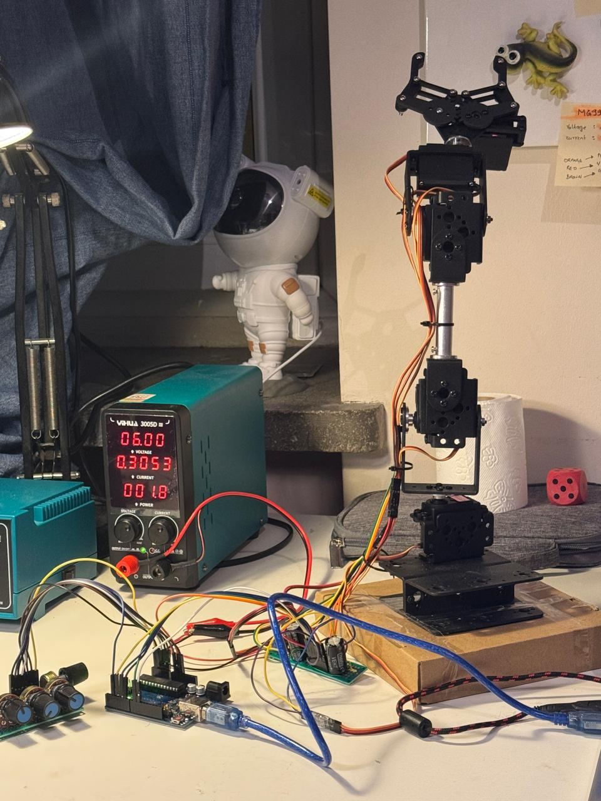
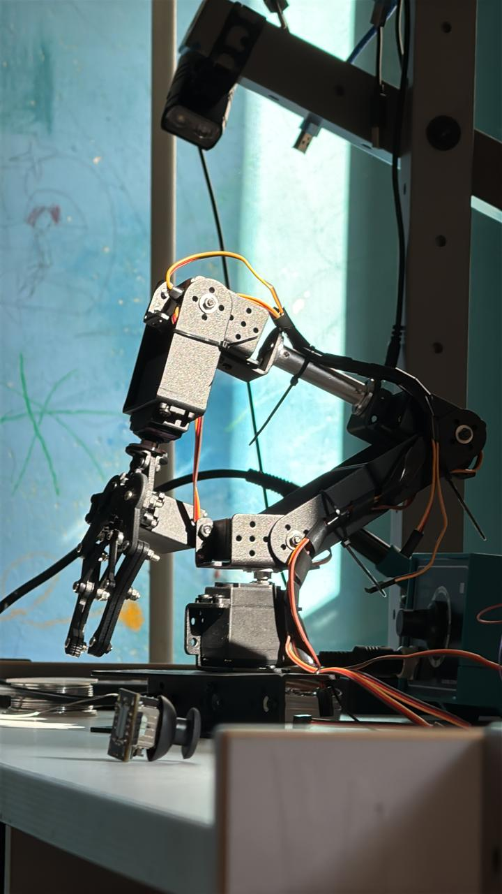

# Robotic Manipulator (4-DOF) – Arduino Based

This project showcases a simple yet powerful **4-DOF robotic arm**, built using MG996R servo motors and controlled via four potentiometers. The system is designed to perform basic pick-and-place operations, ideal for demonstrating motion control, embedded systems, and robotics fundamentals.

---
## 📸 Project Showcase

| Prototype Standing View | Manipulator in Action |
|-------------------------|------------------------|
|  |  |

---
## 🛠️ Features

- ✅ **4 Degrees of Freedom**:
  - Shoulder (up/down)
  - Elbow (forward/back)
  - Wrist (vertical)
  - Gripper (open/close)

- 🎮 **Manual Control with Potentiometers**
- ⚡ **Stable Power Circuit with 4700µF Capacitor**
- 🔌 **Built on Arduino UNO**
- 🧱 Compact & modular structure
- 📦 Tested with real pick-and-place demo (dice object)

---

## 📷 Demo

> See it in action on my [Instagram Reel](#)  
> More updates coming soon.

---

## 🧰 Hardware Used

- 5x **MG996R Servo Motors**
- 1x **Arduino UNO/Nano**
- 5x **10kΩ Potentiometers**
- 1x **4700µF Electrolytic Capacitor**
- Bench **Power Supply (5.8V, 4.2A)**
- Diodes (e.g., 1N4007 for flyback protection)
- Basic electronics (breadboard, jumper wires)

---

## ⚙️ Circuit Overview

- Servos powered from external PSU (5.8V)
- Common ground shared with Arduino
- Potentiometers connected to analog pins (A0–A3)
- Servo signal pins connected to D3, D6, D9, and D5

---

